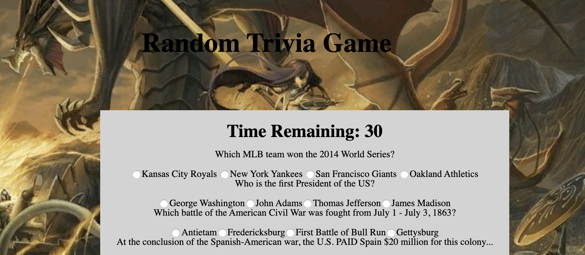

# TriviaGame

##Summary

This is the "Random Trivia Game" using Javascript and Jquery to manipulate HTML.

##Site Picture



## Technologies Used

HTML - This portion was used to create the base structure of the game and the final results page.

CSS - CSS is used to style and format the page including adding the background image.

Javascript and JQuery - Both were used to create the necessary functions to make the game run. 

## Code Snipit

This snipit shows the functions required to make the time counter go down to zero. This also states that when the timer reaches zero, the questions and choices hide while the results page appear.

```js

function startTime() {
        if (!timeRun) {
            timeRun = true;
            intervalID = setInterval(decrement, 1000);
        }
    }

    function decrement() {

        time--;

        $("#timer-text").text("Time Remaining: " + time);
        if (time === 0) {
            stop();
            $(".quiz-questions").hide();
            $("#final-results").show();
        }
    }

    function stop() {
        timeRun = false;
        clearInterval(intervalID);
    }